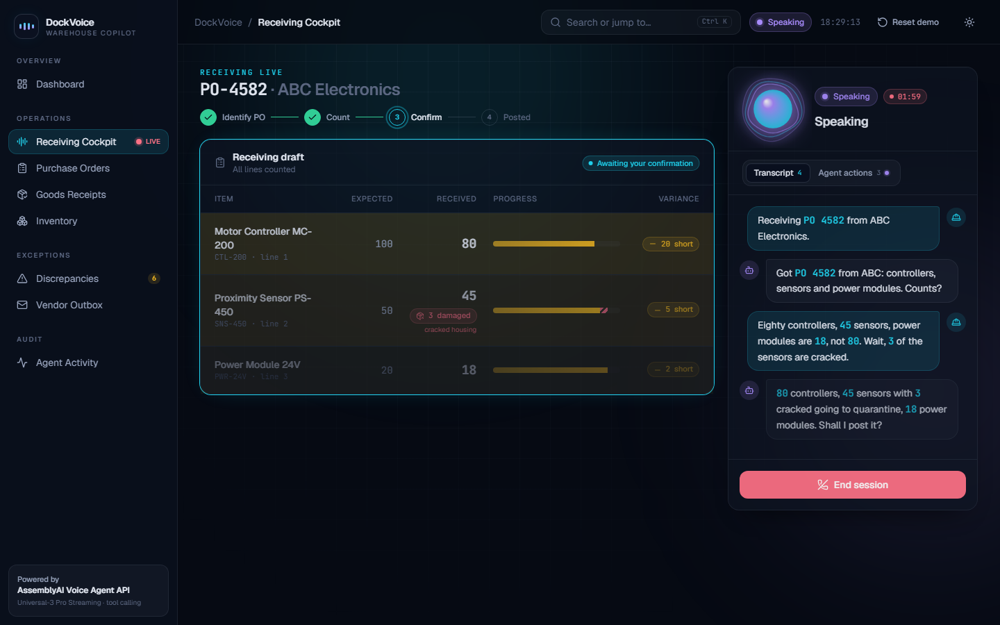
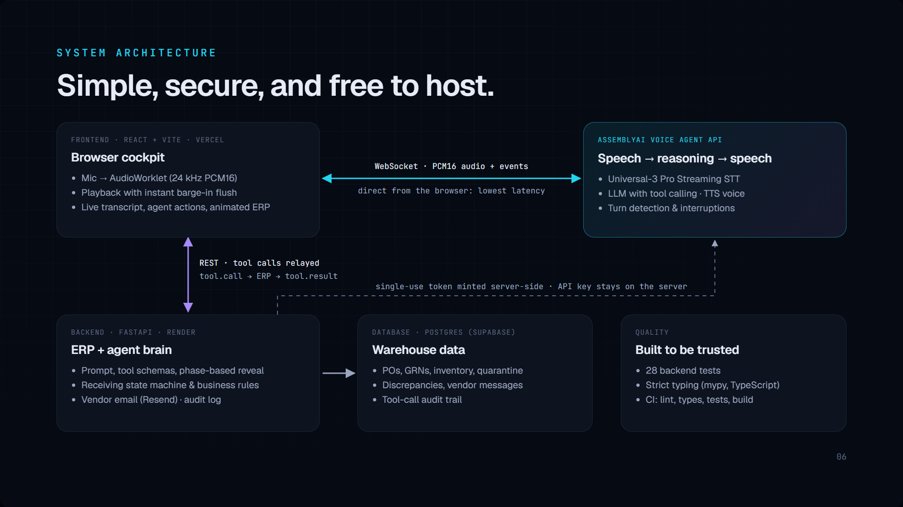

# DockVoice: Warehouse Voice Copilot

**Receive shipments at the speed of speech.** A voice agent for the warehouse receiving dock, built
on the [AssemblyAI Voice Agent API](https://www.assemblyai.com/docs/voice-agents/voice-agent-api).



A worker with full hands says:

> "Receiving PO 4582 from ABC Electronics. We got eighty controllers, actually sorry, eight zero,
> and forty-five sensors. The power modules are eighteen, not eighty."

The agent opens the purchase order, records the counts (the correction replaces the earlier number
instead of being added to it), reads back the totals and shortages, and only after a spoken "yes" posts the goods
receipt: **GRN, inventory movements and discrepancy records in one transaction**. Then it emails the
vendor about the shortage, due date included.

## Why this is a hard voice problem

| Challenge | How DockVoice handles it |
|---|---|
| Numbers in noisy speech | Universal-3 Pro Streaming, plus **keyterms** built from live ERP data (vendors, items, open POs) and a domain **transcription prompt** |
| Self-corrections ("eighty… eight zero", "eighteen, not eighty") | The agent edits a **draft**; each count **overwrites** the line, never accumulates. Implausible values (80 of 20 outstanding) come back as warnings the agent must double-check |
| Never posting something the worker didn't confirm | Backend state machine: `DRAFT → AWAITING_CONFIRMATION → POSTED`. Posting requires the exact draft version that was read back; any correction after the read-back invalidates it |
| An LLM that might "just call post" | **Progressive tool reveal**: `post_goods_receipt` doesn't exist in the agent's tool list until the read-back has happened |
| Interruptions | Server-side turn detection and barge-in; the client flushes audio instantly and drops stale tool results |
| Real ERP semantics | Partial receipts, outstanding quantities, over-receipts, fuzzy item matching ("power mods" → Power Module 24V), vendor cross-check |

## Architecture



- The API key never leaves the server; the browser gets a **single-use token**.
- The browser talks to AssemblyAI directly (lowest latency); the backend is plain REST, so it runs
  on free hosting with no long-lived connections.
- Every tool call is recorded in an audit trail (see the **Agent Activity** page).

## Tech stack

| Layer | Technology |
|---|---|
| **Voice AI** | AssemblyAI Voice Agent API: Universal-3 Pro Streaming STT, LLM tool calling, TTS, turn detection and barge-in, keyterms + transcription prompt, far-field voice focus, single-use browser tokens |
| **Frontend** | React 19, TypeScript (strict), Vite, Tailwind CSS v4, Motion, TanStack Query, Zustand, React Router, Recharts, Web Audio API + AudioWorklet |
| **Backend** | Python 3.12, FastAPI, Pydantic v2, SQLAlchemy 2.0, psycopg 3, RapidFuzz (spoken item matching), httpx |
| **Data & services** | PostgreSQL on Supabase (SQLite locally), Resend for vendor email |
| **Hosting** | Vercel (frontend), Render (API), Supabase (database), UptimeRobot keep-alive: all free tier |
| **Quality** | pytest, mypy (strict), Ruff, TypeScript strict, oxlint, GitHub Actions CI |

## The app

| Page | What it shows |
|---|---|
| Welcome | Cinematic landing page with a looping scripted demo |
| Dashboard | Live KPIs, 14-day receipts trend, vendor fill rates, recent GRNs |
| **Receiving Cockpit** | Voice orb driven by real audio levels, live transcript, the draft table with animated corrections, tool-call timeline, GRN stamp, vendor email |
| Purchase Orders / Goods Receipts | ERP lists and detail views, including a printable GRN document |
| Inventory | Stock vs reorder point, live movement feed |
| Discrepancies / Vendor Outbox | Shortages by status; the emails sent to vendors |
| Agent Activity | Audit trail of every tool call with arguments and results |

## Business model

| | |
|---|---|
| **Who buys** | Mid-size distributors, 3PLs and manufacturers with 5–50 dock doors, already on an ERP (Business Central, NetSuite, SAP B1) but still receiving on paper or scanners. Buyer: operations manager. Champion: finance, for vendor recovery. |
| **Market** | ~40,000 general warehousing businesses in the US alone (IBISWorld, 2025); warehouse software is a $3.4–5.7B market in 2025, growing ~15–20% a year (range across analyst reports). |
| **Pricing** | $49 per dock door per month, all-inclusive: voice, ERP connector and vendor follow-ups. Two-week pilot on one door, then expand; sold through ERP partners. |

**Worked example, one dock door per month** (illustrative assumptions: 10 receipts/day × 22 days, ~2 min of voice per receipt):

| | |
|---|---|
| Labor saved: 220 receipts × 4 min × $25/h | +$367 |
| Miscounts avoided: 2% of receipts × $50 (low end of the $50–250 industry estimate per error) | +$220 |
| **Value to the customer** | **$587**, about **12x** the $49 price |
| Our voice cost: 220 × 2 min × AssemblyAI's $4.50/h | ≈ $33, so ~33% gross margin at list voice pricing |

This is before counting vendor credits recovered from documented shortages and damage.

## Run locally

Requirements: Python 3.11+, Node 20+.

```bash
# Backend
cd backend
python -m venv .venv && .venv/Scripts/activate   # macOS/Linux: source .venv/bin/activate
pip install -e ".[dev]"
cp .env.example .env                              # add your ASSEMBLYAI_API_KEY
uvicorn app.main:app --reload --port 8000

# Frontend (second terminal)
cd frontend
npm install
npm run dev                                       # http://localhost:5173
```

The database is created and seeded on first start. **Reset demo** in the top bar reseeds it.

## Deploy (free)

1. **Database:** create a Supabase project and copy the Postgres connection string.
2. **Backend:** on Render, choose *New → Blueprint* and point it at this repo (`render.yaml`). Set
   `ASSEMBLYAI_API_KEY`, `DATABASE_URL` and `CORS_ORIGINS` (your Vercel URL).
3. **Frontend:** on Vercel, import the repo with root directory `frontend` and set `VITE_API_URL` to
   the Render URL.
4. **Keep-alive:** add an UptimeRobot monitor on `https://<render-url>/api/health` every 5 minutes.
   It keeps the free Render instance awake and the Supabase database active.
5. Optional: set `RESEND_API_KEY` and `VENDOR_EMAIL_OVERRIDE` (your inbox) for real vendor emails.

## Quality

```bash
cd backend && pytest -q && ruff check app tests && mypy app   # tests, lint, strict types
cd frontend && npm run lint && npm run build
```
